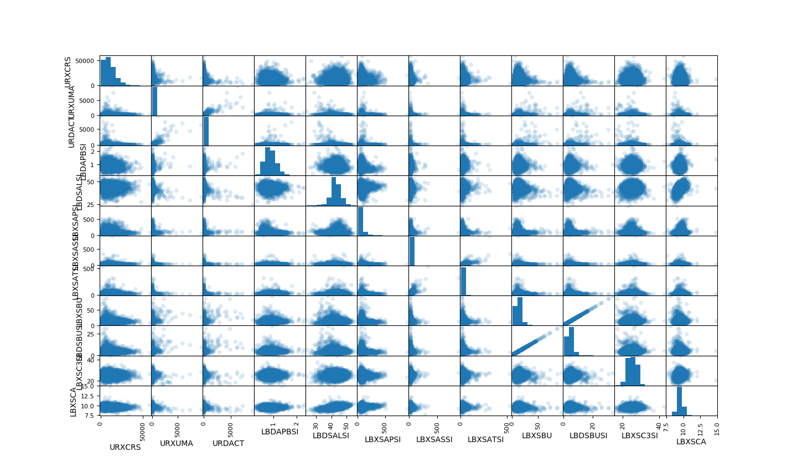
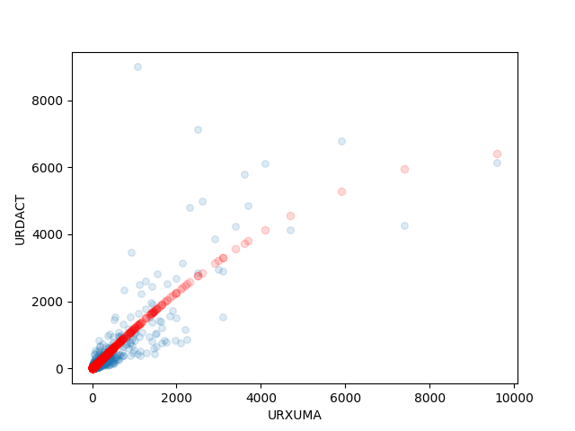

# visual_explore_data_labs
Visual exploration of public laboratory data in Python.

The data has been acquired from [here](https://www.kaggle.com/cdc/national-health-and-nutrition-examination-survey)

The full dictionary of the columns of the dataset can be found [here](https://wwwn.cdc.gov/Nchs/Nhanes/Search/variablelist.aspx?Component=Laboratory&CycleBeginYear=2013)

## scatter_matrix.py
This script creates a matrix with some columns for visual exploration of the data. Here is an example of this graphics:

## linear_regression.py
This script creates a linear regression model of 2nd degree between 2 variables that were identified in the scatter matrix to have some relation.

Here is a scatter plot of the data the regression curve in red:

# Requirements: 
- matplotlib
- pandas
- scikit-learn